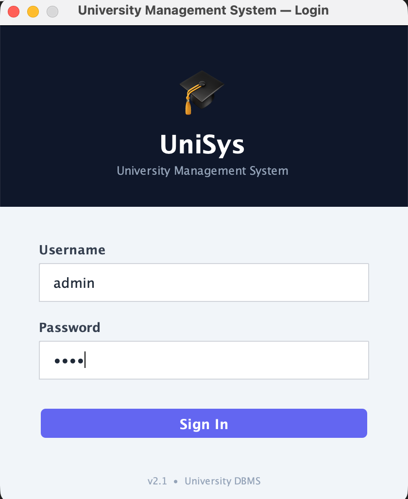
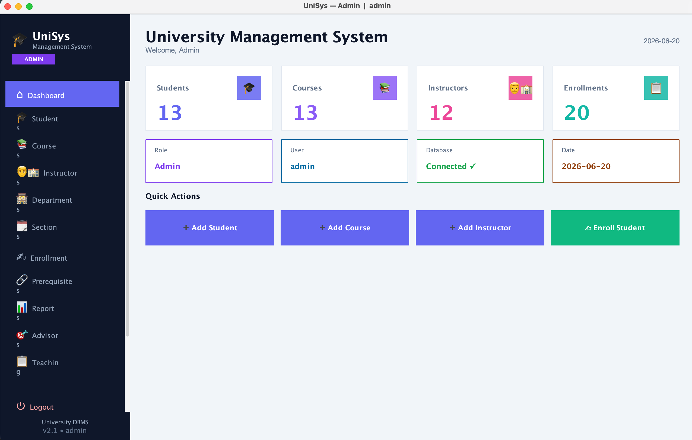
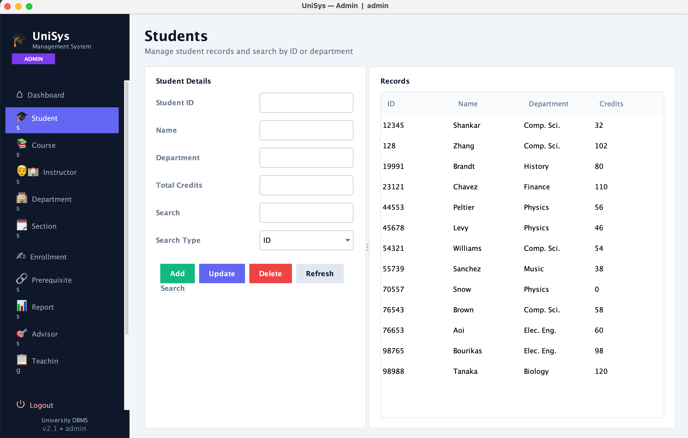
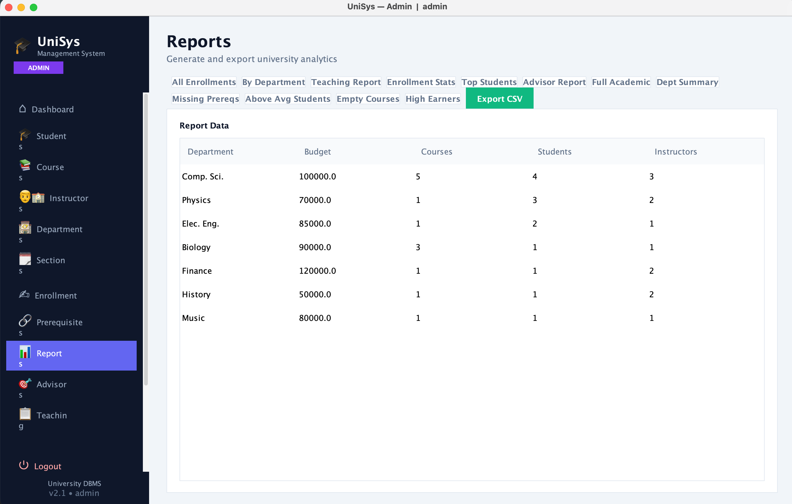

<div align="center">


<br/>

[](https://www.java.com)
[](https://www.mysql.com)
[](https://docs.oracle.com/javase/tutorial/jdbc/)
[](https://docs.oracle.com/javase/tutorial/uiswing/)
[](https://maven.apache.org)
[](LICENSE)

<p align="center">
  A professional desktop application for managing university records.<br/>
  Built with <strong>Java + JDBC + MySQL</strong> — covering SQL Chapters 3, 4 & 5.
</p>

</div>

---

## 📸 Screenshots

<div align="center">

| Login | Dashboard |
|-------|-----------|
|  |  |

| Students | Reports |
|----------|---------|
|  |  |

</div>

---

## ✨ Features

- 🔐 **Login System** — Secure authentication with role-based access
- 👥 **3 Roles** — Admin, Instructor, Student each see a different menu
- 📊 **Live Dashboard** — Real-time stats loaded asynchronously (no UI freeze)
- 🎓 **Student Management** — Full CRUD with search by name or department
- 📚 **Course & Section Management** — Complete academic catalog
- ✍️ **Enrollment** — Transaction-safe registration with duplicate check & rollback
- 📋 **12 Report Types** — JOINs, GROUP BY, subqueries, correlated subqueries
- 📤 **CSV Export** — Export any report to spreadsheet
- ⚡ **Optimized Startup** — DB connects in background thread parallel to UI

---

## 🗂️ Project Structure

```
src/main/java/
├── Main.java
├── model/          # Data entities (Student, Instructor, Course, ...)
├── dao/            # Database access layer (JDBC + PreparedStatement)
├── ui/             # Java Swing panels and frames
├── database/       # DBConnection (singleton JDBC connection)
└── util/           # UITheme, UIUtil, CSVExporter, Session, ValidationUtil
```

---

## 🗄️ Database Schema

> Uses the standard university schema from *Database System Concepts* — Silberschatz, Korth & Sudarshan

| Table | Primary Key | Description |
|-------|-------------|-------------|
| `department` | dept_name | Departments with budget |
| `student` | id | Students with credits |
| `instructor` | id | Instructors with salary |
| `course` | course_id | Course catalog |
| `section` | course_id, sec_id, semester, year | Offered sections |
| `takes` | id, course_id, sec_id, semester, year | Student enrollments |
| `teaches` | id, course_id, sec_id, semester, year | Teaching assignments |
| `advisor` | s_id | Student-advisor mapping |
| `prereq` | course_id, prereq_id | Prerequisites |
| `users` | username | Login credentials + role |

---

## 🧠 SQL Concepts Demonstrated

### Chapter 3 — Basic SQL
```sql
INSERT INTO student (id, name, dept_name, tot_cred) VALUES (?, ?, ?, ?)
UPDATE student SET name=?, dept_name=?, tot_cred=? WHERE id=?
DELETE FROM student WHERE id=?
SELECT * FROM student WHERE name LIKE ? OR dept_name LIKE ?
```

### Chapter 4 — Intermediate SQL
```sql
-- JOIN across 6 tables
SELECT s.name, c.title, i.name, d.dept_name, t.semester, t.year, tk.grade
FROM takes tk
JOIN student s ON tk.id = s.id
JOIN course c ON tk.course_id = c.course_id
JOIN teaches te ON ...
JOIN instructor i ON te.id = i.id
JOIN department d ON c.dept_name = d.dept_name

-- Scalar Subquery
SELECT * FROM student
WHERE tot_cred > (SELECT AVG(tot_cred) FROM student)

-- Correlated Subquery
SELECT * FROM instructor i
WHERE i.salary > (SELECT AVG(i2.salary) FROM instructor i2
                  WHERE i2.dept_name = i.dept_name)

-- NOT EXISTS
SELECT * FROM course c
WHERE NOT EXISTS (SELECT 1 FROM takes t WHERE t.course_id = c.course_id)
```

### Chapter 5 — Advanced SQL & JDBC
```java
// Transaction with full rollback
con.setAutoCommit(false);
try {
    // Step 1: check duplicate
    // Step 2: insert enrollment
    con.commit();
} catch (SQLException e) {
    con.rollback();  // undo everything on failure
} finally {
    con.setAutoCommit(true);
}
```

---

## 🔐 Role-Based Access

| Module | Admin | Instructor | Student |
|--------|:-----:|:----------:|:-------:|
| Dashboard | ✅ | ✅ | ✅ |
| Students | ✅ | ❌ | ✅ (view) |
| Courses | ✅ | ✅ | ❌ |
| Instructors | ✅ | ✅ | ❌ |
| Departments | ✅ | ❌ | ❌ |
| Sections | ✅ | ✅ (own) | ❌ |
| Enrollment | ✅ | ❌ | ✅ (own) |
| Reports | ✅ | ❌ | ✅ (grades) |
| Teaching | ✅ | ✅ (own) | ❌ |
| Advisors | ✅ | ❌ | ❌ |

---

## ⚡ Performance Optimizations

| Problem | Solution |
|---------|----------|
| Slow startup | `DBConnection.init()` runs in background thread parallel to UI |
| UI freeze on login | `SwingWorker` executes DB query asynchronously |
| UI freeze on panel switch | Lazy loading with `SwingWorker` + loading indicator |
| Connection overhead | Single shared connection, reconnected only if closed |

---

## 🚀 Getting Started

### Prerequisites
- Java 17+
- MySQL 8.0+
- Maven 3.8+

### 1. Clone the repository
```bash
git clone https://github.com/YOUR_USERNAME/YOUR_REPO_NAME.git
cd YOUR_REPO_NAME
```

### 2. Set up the database
```sql
CREATE DATABASE university;
USE university;

-- Run the standard university schema (from textbook)
-- Then add the users table:
CREATE TABLE users (
    username VARCHAR(50) PRIMARY KEY,
    password VARCHAR(255) NOT NULL,
    role VARCHAR(20) NOT NULL
);

INSERT INTO users VALUES
('admin',      'admin123',      'ADMIN'),
('student',    'student123',    'STUDENT'),
('instructor', 'instructor123', 'INSTRUCTOR');

-- Optional: enrollment view
CREATE OR REPLACE VIEW enrollment_view AS
SELECT s.id, s.name AS student_name, c.title AS course_title,
       c.dept_name, t.semester, t.year, t.grade
FROM takes t
JOIN student s ON t.id = s.id
JOIN course  c ON t.course_id = c.course_id;
```

### 3. Configure database connection
Edit `src/main/java/database/DBConnection.java`:
```java
private static final String URL = "jdbc:mysql://localhost:3306/university";
private static final String USER = "root";
private static final String PASSWORD = "your_password";
```

### 4. Build and run
```bash
mvn clean package
java -jar target/university-management-system.jar
```

### Default Credentials

| Role | Username | Password |
|------|----------|----------|
| Admin | `admin` | `admin123` |
| Student | `student` | `student123` |
| Instructor | `instructor` | `instructor123` |

---

## 📦 Dependencies

```xml
<!-- pom.xml -->
<dependency>
    <groupId>mysql</groupId>
    <artifactId>mysql-connector-java</artifactId>
</dependency>
<dependency>
    <groupId>org.jfree</groupId>
    <artifactId>jfreechart</artifactId>
</dependency>
```

## 📖 References

- Silberschatz, A., Korth, H. F., and Sudarshan, S. — *Database System Concepts*
- [Oracle JDBC Documentation](https://docs.oracle.com/en/java/javase/17/docs/api/java.sql/java/sql/package-summary.html)
- [MySQL Connector/J](https://dev.mysql.com/doc/connector-j/en/)
- [JFreeChart](https://www.jfree.org/jfreechart/)

---

<div align="center">

Made with ❤️ for Database Systems Course

⭐ **Star this repo if you found it helpful!**

</div>
